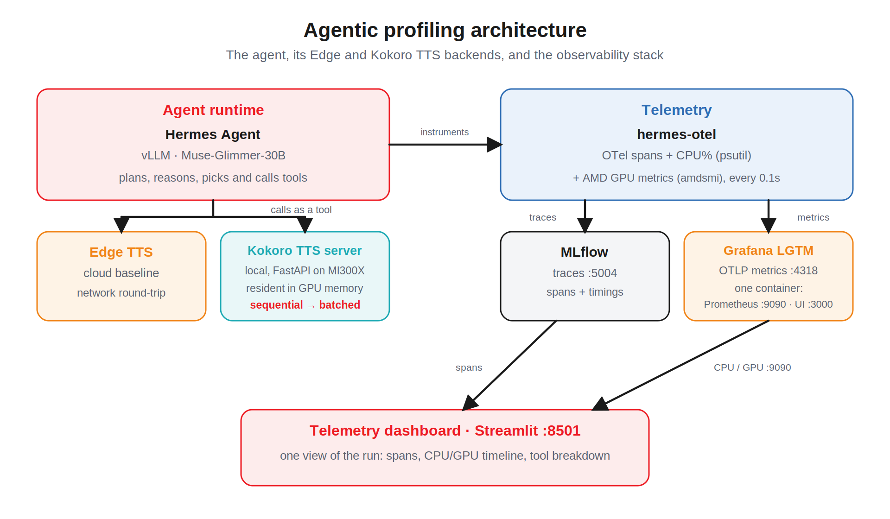

<p align="center">
  
</p>

<h1 align="center">AMD Agentic AI Profiling Workshop</h1>

<p align="center">
  <b>Profile an autonomous AI agent, find its bottleneck, and optimize it on AMD Instinct&trade; GPUs.</b>
</p>

<p align="center">
  
  
  
  
  
</p>

---

## Overview

This is a hands-on, beginner-friendly workshop on **observability-driven optimization** of AI agents. You run a real [Hermes Agent](https://hermes-agent.nousresearch.com/docs/getting-started/quickstart), capture its telemetry with MLflow, read a purpose-built dashboard to spot the slowest step, optimize that one tool, and prove the speed-up with hardware metrics from an AMD Instinct&trade; MI300X GPU.

Text-to-speech (TTS) is only the example. The real subject is a **repeatable profiling loop** you can point at any agent task.

<p align="center">
  
</p>

## What you will learn

- Run a Hermes agent and capture its telemetry end to end
- Read a telemetry dashboard to identify a slow tool
- Swap in an optimized implementation of that tool
- Compare before and after, and see how GPU utilization changes

## The workflow you will follow

<p align="center">
  
</p>

Run the agent, **Fetch** the run in the dashboard, inspect the spans and GPU usage, optimize the slow tool, and measure again. Repeat until the bottleneck is gone.

## The optimization at a glance

The default TTS tool feeds the GPU one sentence at a time, leaving the MI300X mostly idle. The workshop adds a **batched** mode that groups sentences into a single GPU forward pass.

<p align="center">
  
</p>

---

## Repository contents

| Path | What it is |
| :--- | :--- |
| `tts.ipynb` | **The workshop notebook.** Start here. |
| `tts_executed.ipynb` | The same notebook with all cells already executed, so you can read the expected outputs without a GPU. |
| `utils/helper.sh` | One-shot launcher for the full backend (agent, telemetry, dashboard, Kokoro server). |
| `utils/kokoro_server.py` | The local Kokoro TTS server (FastAPI + Uvicorn), including the batched inference path. |
| `utils/hermes_profiler.py` | The Streamlit telemetry dashboard. |
| `utils/hermes_advanced_profiling.patch` | Extends hermes-otel to record CPU/GPU usage per span. |
| `utils/requirements.txt` | Python dependencies for the notebook and dashboard. |
| `utils/clear_cache.sh` | Clears the GPU kernel cache for cold-run benchmarks. |
| `custom_tools/kokoro_tts_tool.py` | The custom `kokoro_tts` tool added to Hermes. |
| `utils/Dockerfile`, `utils/docker-entrypoint.sh` | Build and run the all-in-one workshop container. See [utils/DOCKER.md](utils/DOCKER.md). |
| `assets/` | Diagrams, dashboard screenshots, and reference outputs. |
| `scripts/` | Generators that rebuild the diagrams and the notebook. |

---

## Prerequisites

| Requirement | Version tested |
| :--- | :--- |
| **Operating system** | Ubuntu 24.04 |
| **GPU** | AMD Instinct&trade; MI300X (192 GB VRAM) with ROCm support |
| **ROCm** | 7.2 (use `rocm-smi` instead of `amd-smi` on 6.4 and earlier) |
| **Python** | 3.12 with `venv` and `pip` |

Verify your GPUs are visible before you start:

```bash
amd-smi
```

> **Model note.** The agent is powered by **Muse-Glimmer-30B**, served with vLLM on the MI300X. On the first run, `utils/helper.sh` overlays the vLLM code from [PR #51655](https://github.com/vllm-project/vllm/pull/51655) onto AMD's `vllm/vllm-openai-rocm:nightly` image and commits it locally as `vllm-muse-glimmer:rocm`. This build happens automatically and only once.

---

## Quick start

The fastest path is the prebuilt Docker image, which bundles every service so
there is nothing to install. If you prefer to run on the host directly, skip to
[Manual setup](#manual-setup).

### Option A: Docker (recommended)

```bash
docker run -d --name amd-agentic-ai-profiling \
  --device=/dev/kfd --device=/dev/dri \
  --security-opt seccomp=unconfined --group-add video \
  --ipc=host --shm-size 16G \
  -p 8888:8888 -p 8501:8501 -p 5004:5004 \
  -v "$HOME/.cache/huggingface:/root/.cache/huggingface" \
  shailensobhee1/amd-agentic-ai-profiling:mi300x
```

Watch it start with `docker logs -f amd-agentic-ai-profiling`. When it prints
`All services are ready`, open `http://<host>:8888/lab/tree/tts.ipynb`.

The model weights are baked into the image, so vLLM starts serving without
downloading anything. The image is correspondingly large (about 70 GB), so
the `docker pull` is the slow step, and it is paid once per host. Full
details, flags and troubleshooting are in [utils/DOCKER.md](utils/DOCKER.md).

### Manual setup

### 1. Clone the repository

```bash
git clone https://github.com/shailensobhee/amd-agentic-ai-profiling-workshop.git
cd amd-agentic-ai-profiling-workshop
```

### 2. Create and activate a virtual environment

```bash
sudo apt install -y python3-venv
python3 -m venv env
source env/bin/activate
```

### 3. Install the notebook dependencies

```bash
python -m pip install --upgrade pip
python -m pip install -r utils/requirements.txt
```

### 4. Start the backend (leave this terminal open)

In a **separate terminal**, launch the full stack. This one script starts the agent model, the patched telemetry, MLflow, the Kokoro TTS server, and the dashboard.

```bash
bash utils/helper.sh
```

> Leave that terminal running for the whole workshop. It keeps the services alive; closing it shuts the backend down. When it finishes starting, it prints the service URLs you will use in the notebook.

### 5. Launch JupyterLab and open the notebook

```bash
jupyter lab --ip=0.0.0.0 --port=8888 --no-browser
```

Open **`tts.ipynb`** and work through it top to bottom. Everything from here on
happens inside the notebook.

<details>
<summary><b>Optional: force JupyterLab dark theme</b></summary>

<br>

The Hermes environment is designed with a dark theme. To match it:

```bash
mkdir -p ./env/share/jupyter/lab/settings
echo '{"@jupyterlab/apputils-extension:themes": {"theme": "JupyterLab Dark"}}' > ./env/share/jupyter/lab/settings/overrides.json
```

</details>

---

## What `utils/helper.sh` starts

<p align="center">
  
</p>

| Service | Port | Role |
| :--- | :--- | :--- |
| Hermes backend (vLLM &middot; Muse-Glimmer-30B) | `8001` | The agent's model that plans and picks tools. |
| Hermes OTel (patched) | n/a | Emits OpenTelemetry traces plus per-span CPU/GPU usage, sampled every 0.1s. |
| MLflow tracking server | `5004` | Records every run with timings and hardware metrics. |
| Telemetry dashboard (Streamlit) | `8501` | A clean overview of each run: spans, CPU/GPU timeline, tool breakdown. |
| Kokoro TTS server | `8092` | The local, self-hosted TTS engine used in the optimization step. |
| AMD Device Metrics Exporter | `5050` | Supplies GPU utilization to the telemetry. |

---

## Service reference

After `utils/helper.sh` is running, these are reachable on the host (replace `<server-ip>` with your machine's address):

| Interface | URL |
| :--- | :--- |
| Telemetry dashboard | `http://<server-ip>:8501` |
| MLflow UI (advanced) | `http://<server-ip>:5004` |
| JupyterLab | `http://<server-ip>:8888` |

---

## Troubleshooting

| Symptom | Fix |
| :--- | :--- |
| `which hermes` prints nothing in the notebook | `utils/helper.sh` has not finished starting, or the notebook was launched from a different environment. Wait for the backend, then relaunch Jupyter from the same shell. |
| Dashboard shows no runs | Click **Fetch**. Runs appear newest first; select the top one. |
| First Kokoro run is slow | Cold-run GPU kernel compilation. Subsequent runs reuse the cached kernels and are much faster. |
| A port is already in use | `utils/helper.sh` frees its ports on start, but a stale process may linger. Stop it, then rerun. |

---

## Regenerating the assets

The notebook and its diagrams are generated from scripts so they stay reproducible and reviewable:

```bash
python scripts/build_diagrams.py       # rebuild the AMD-branded concept diagrams
python scripts/build_tts_notebook.py   # regenerate tts.ipynb from the generator
```

The generator reuses the workshop's backend-driving code cells verbatim, so editing the prose can never change what the notebook actually runs.

---

## Credits

**Authors:** Shailen Sobhee, Sabira Shaik, Jereshea John Mary

Built for AMD developer enablement on AMD Instinct&trade; GPUs. Powered by [Hermes Agent](https://hermes-agent.nousresearch.com) (Nous Research), [MLflow](https://mlflow.org), and [Kokoro TTS](https://github.com/hexgrad/kokoro).
